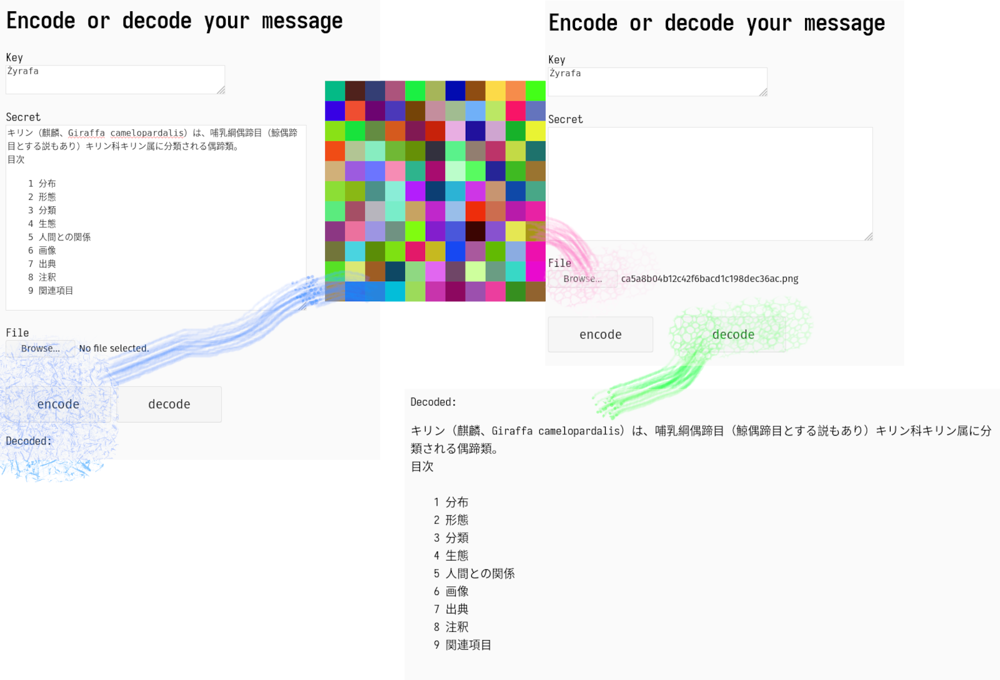

# Carrothko
## Text Encoding/Decoding FastAPI server :snake::zap:
Encodes to colorful squares or to hex gibberish.

Supports all valid unicode characters including whitespace ones.
Based on RC stream cipher, Carrothko cipher aims to be hedonistic more than utilitarian.
Encoded Images are enlarged for aesthetics purposes as serving 2x2 pixel pngs is not very thrilling.


## In Browser
### /img

Presents form that allows to encode to/decode from weird pixel art



### /string
Similar to /img but encodes to plain text

### /secret
Behind Basic Auth

## Installing
### with poetry


```
git clone https://github.com/ukmrs/carrothko && cd carrothko

# Install the required dependencies
poetry install

# Start the server
poetry run uvicorn src.html:app --reload
```

## In Terminal

```
curl localhost:8000/encode/key/secret --output file.png

```
